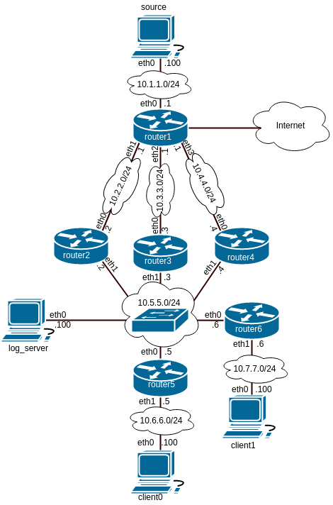

# PIM-DM - Test State-Refresh

### Topology



### Requirements

- Kathara (https://www.kathara.org/)
- Docker
- gnome-terminal


### Execute lab test


```sh
$ . script.sh
```

This script file will clone pim-dm repository to get the most updated version on the lab environment. Then will start the VMs through Kathara and change some settings on the virtual bridges that connect the VMs.

### Close lab test

```sh
$ kathara wipe
```

